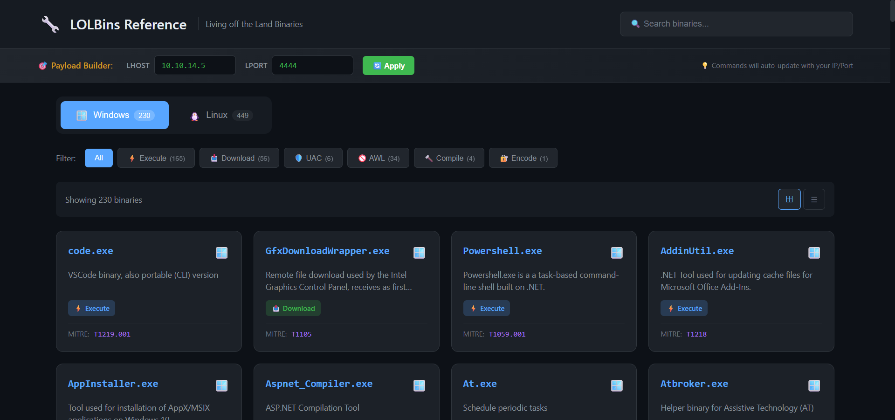

# 🔧 LOLBins Reference

[](https://opensource.org/licenses/MIT)
[](https://yourusername.github.io/LOLBins-Reference)

A comprehensive, interactive reference for **Living off the Land Binaries** (LOLBins) for Windows (LOLBAS) and Linux (GTFOBins).



## 🌟 Features

- **📂 600+ LOLBins** - Windows (LOLBAS) + Linux (GTFOBins) binaries
- **🔄 Auto-Update** - Script to fetch latest data from official sources
- **🎯 Payload Builder** - Real-time LHOST/LPORT replacement in commands
- **🔍 Real-time Search** - Quickly find binaries by name, description, or technique
- **🏷️ Category Filters** - Filter by Shell, Execute, File Read/Write, RevShell, and more
- **📋 One-Click Copy** - Copy commands to clipboard instantly
- **🎯 MITRE ATT&CK Mapping** - Each binary mapped to MITRE techniques
- **🛡️ Detection Tips** - Blue team guidance for each technique
- **📱 Responsive Design** - Works on desktop and mobile
- **🌙 Dark Theme** - Easy on the eyes during late-night pentests

## 🚀 Live Demo

Visit: [https://Ilias1988.github.io/LOLBins-Reference](https://Ilias1988.github.io/LOLBins-Reference)

## 📦 Categories

### Windows (LOLBAS)
| Category | Description |
|----------|-------------|
| ⚡ Execute | Code/command execution |
| 📥 Download | File download capabilities |
| 🛡️ UAC Bypass | UAC bypass techniques |
| 🚫 AWL Bypass | Application whitelist bypass |
| 🔨 Compile | Code compilation |
| 🔐 Encode | Encoding/decoding |

### Linux (GTFOBins)
| Category | Description |
|----------|-------------|
| 💀 Shell | Spawn interactive shells |
| ⚡ Execute | Command execution |
| 📖 File Read | Read arbitrary files |
| ✏️ File Write | Write arbitrary files |
| 🔄 RevShell | Reverse shell capabilities |

## 🛠️ Installation

### Option 1: GitHub Pages (Recommended)
1. Fork this repository
2. Go to Settings → Pages
3. Set source to "main" branch
4. Your site will be available at `https://Ilias1988.github.io/LOLBins-Reference`

### Option 2: Local Development
```bash
# Clone the repository
git clone https://github.com/Ilias1988/LOLBins-Reference.git
cd LOLBins-Reference

# Open in browser
start index.html  # Windows
open index.html   # macOS
xdg-open index.html  # Linux

# Or use Python's built-in server
python -m http.server 8080
# Visit http://localhost:8080
```

## 🔄 Database Update

Keep your database up-to-date with the latest binaries from official sources!

### Prerequisites
```bash
pip install -r requirements.txt
```

### Update Steps

```bash
# 1. Clone GTFOBins repository (required for Linux binaries)
git clone https://github.com/GTFOBins/GTFOBins.github.io.git

# 2. Run the update script
python update_db.py
```

### What the script does:
- 🪟 **Windows**: Downloads LOLBAS data directly from GitHub (no clone needed)
- 🐧 **Linux**: Parses GTFOBins from the cloned repository
- 📄 **Output**: Generates `js/data.js` with all binaries

### Expected Output:
```
╔═══════════════════════════════════════════════════════════╗
║  🔧 LOLBins Reference - Database Updater                  ║
║  Updates from LOLBAS & GTFOBins official repositories     ║
╚═══════════════════════════════════════════════════════════╝

🐧 [Linux] Checking local folder: GTFOBins.github.io/_gtfobins
   ↳ Found 450 files. Parsing...
✅ [Linux] Success! Parsed 449 binaries from disk.
🪟 [Windows] Downloading LOLBAS Repository...
   ↳ Found 230 YAML files. Parsing...
✅ [Windows] Success! Parsed 230 binaries from web.

🎉 DATABASE UPDATE COMPLETE!
📊 Statistics:
   • Windows (LOLBAS): 230 binaries
   • Linux (GTFOBins): 449 binaries
   • Total: 679 binaries
```

## 🎯 Payload Builder

The Payload Builder feature allows you to customize IP and Port in all commands:

1. Enter your **LHOST** (attacker IP) in the config bar
2. Enter your **LPORT** (listening port) in the config bar
3. All commands automatically update with your values!

**Replaced placeholders:**
- IPs: `ATTACKER_IP`, `127.0.0.1`, `192.168.x.x`, `10.x.x.x`
- Ports: `4444`, `1337`, `8080`, `9001`

## 📖 Usage

1. **Select OS** - Click on Windows 🪟 or Linux 🐧 tab
2. **Set Payload Config** - Enter your LHOST/LPORT
3. **Filter by Category** - Click category buttons to filter
4. **Search** - Type in the search bar (or press `/` to focus)
5. **View Details** - Click on any card to see full details
6. **Copy Commands** - Click the copy button to copy commands

## ⌨️ Keyboard Shortcuts

| Key | Action |
|-----|--------|
| `/` | Focus search bar |
| `Escape` | Close modal |

## 📚 Data Sources

- [LOLBAS Project](https://lolbas-project.github.io/) - Living Off The Land Binaries, Scripts and Libraries
- [GTFOBins](https://gtfobins.github.io/) - Unix binaries that can be exploited
- [MITRE ATT&CK](https://attack.mitre.org/) - Adversary tactics and techniques

## 📁 Project Structure

```
LOLBins-Reference/
├── index.html          # Main HTML file
├── update_db.py        # Database update script
├── requirements.txt    # Python dependencies
├── README.md           # This file
├── LICENSE             # MIT License
├── .gitignore          # Git ignore rules
├── css/
│   └── style.css       # Styles
└── js/
    ├── app.js          # Application logic
    └── data.js         # LOLBins database (auto-generated)
```

## ⚠️ Disclaimer

This tool is intended for **educational purposes** and **authorized security testing only**. 

The techniques documented here can be used for:
- ✅ Penetration testing (with authorization)
- ✅ Red team exercises
- ✅ Security research and education
- ✅ Blue team defense preparation

**Do NOT use these techniques for unauthorized access to systems.**

## 🤝 Contributing

Contributions are welcome!

1. Fork the repository
2. Create your feature branch (`git checkout -b feature/AmazingFeature`)
3. Commit your changes (`git commit -m 'Add some AmazingFeature'`)
4. Push to the branch (`git push origin feature/AmazingFeature`)
5. Open a Pull Request

## 📄 License

This project is licensed under the MIT License - see the [LICENSE](LICENSE) file for details.

## 🙏 Acknowledgments

- [LOLBAS Project](https://lolbas-project.github.io/) maintainers
- [GTFOBins](https://gtfobins.github.io/) maintainers
- The security research community

---

Made with ❤️ for the Security Community
